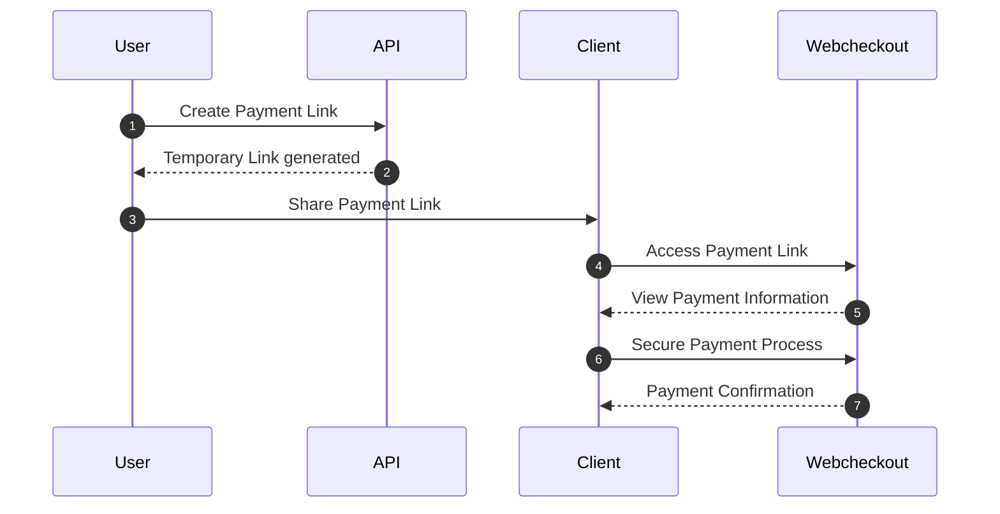

# Introduction

## Overview
Placetopay's Payment Link API provides a programming interface that allows developers to integrate the functionality of generating payment sessions with Placetopay's payment gateway. This API facilitates the creation of unique payment links that can be shared with customers to perform secure and convenient transactions through the Placetopay gateway.

## Flow Description (User)
1. **Creation of the Payment Link:** A user uses the Payment Link API to create a new payment link, specifying details such as the name, amount, description, and optionally, an expiration date.
2. **Generation of the Temporary Link:** The API generates a temporary link on the "MICROSITES" platform that contains all the payment information. This link is unique and is associated with the newly created payment link.
3. **Access to the Link:** If the link creation is successful, the user is provided with the temporary link, which is a unique URL. The user can access this URL using their web browser.
4. **Payment Information:** When opening the link, the user sees all relevant payment information, such as the purchase name, the amount to be paid, and a detailed description. Additionally, a "Pay" button is presented.
5. **Redirection to WebCheckout:** If the user decides to proceed with the payment, they click the "Pay" button. At that moment, they are automatically redirected to a "WebCheckout" session.
6. **Secure Payment Process:** In "WebCheckout," the user completes the payment process securely. All payment-related information, such as the amount and description, is automatically loaded into the payment process for the user to complete the transaction efficiently and accurately.
7. **Payment Confirmation:** After successfully completing the payment, the user receives a confirmation and a receipt for the transaction. Simultaneously, the status of the payment link on the "MICROSITES" platform is updated to reflect the payment made.

## Objective
The main objective of this documentation is to provide developers with a comprehensive guide on how to use Placetopay's Payment Link API to meet the integration needs of their applications. Here you will find detailed information about the available endpoints, required authentication methods, usage examples, and more.

## Audience
This documentation is aimed at software developers and engineering teams interested in integrating Placetopay's online payment functionality into their applications. Users are expected to have basic knowledge of software development and be familiar with concepts such as REST APIs and HTTP authentication.

## Features
- [Authentication](https://placetopay-api.stoplight.io/docs/payment-links-docs/y9sjfrpqghub7-autenticacion)
- [Creating a Link](https://placetopay-api.stoplight.io/docs/payment-links-docs/7hzkts3nksm2l-crear-un-link-de-pago)
- [Querying a Link](https://placetopay-api.stoplight.io/docs/payment-links-docs/08ix4elnc4kxf-consultar-un-link-de-pago)
- [Deactivating a Link](https://placetopay-api.stoplight.io/docs/payment-links-docs/tz6ngh6jotshk-desactivar-un-link-de-pago-en-desarrollo)

> #### Pilot Version
>
> The API is currently in its pilot version. During this phase, tests will be conducted to certify its effectiveness and stability. Participating developers are encouraged to use the pilot version to experiment with the API and provide valuable feedback for its continuous improvement.